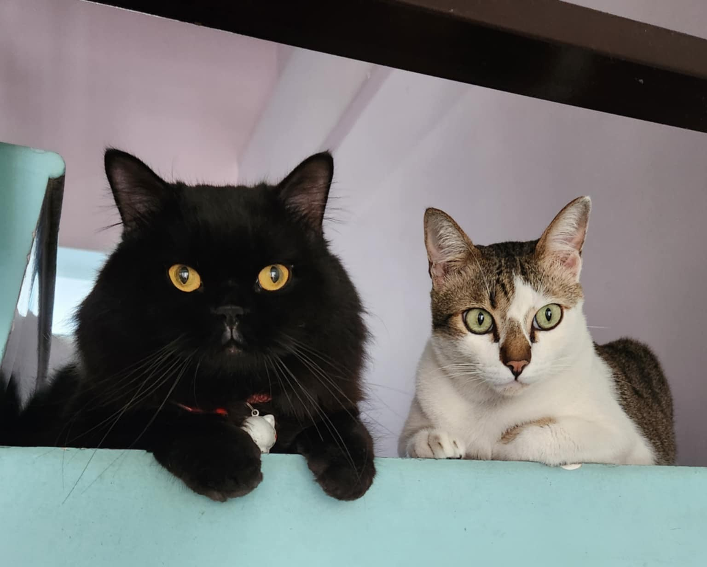

   

## [Some stuff about me]{.underline}

-   My name is actually **Y**, though I believe it is easier for many foreign friends to call me by my middle name, **Minh**. However, if you come visit my hometown and ask people around about Minh, you would probably never find me 🙂

-   I'm a huge fan Vietnamese goi cuon, Korean kimchi, and French croissants 🥐

-   My recent favorite series is *Peaky Blinders*. Finished all 6 seasons in one week.

## [Education]{.underline}

::::::::::::::: timeline
:::::::: timeline-item
::: timeline-year
2024–2025
:::

::::: {style="display:flex; flex-direction:column;"}
::: timeline-degree
Master 2 GenE2
:::

::: timeline-note
Mention Très Bien
:::
:::::

::: timeline-institution
Université Paris-Saclay \| France
:::
::::::::

:::::::: timeline-item
::: timeline-year
2020–2024
:::

::::: {style="display:flex; flex-direction:column;"}
::: timeline-degree
BSc in Biotechnology
:::

::: timeline-note
Excellent degree
:::
:::::

::: timeline-institution
International University – VNU-HCM \| Vietnam
:::
::::::::
:::::::::::::::

## [Find me]{.underline}

<ul class="contact-info">

<li><i class="fa-solid fa-envelope"></i> <a href="mailto:minh-y.tran@universite-paris-saclay.fr">minh-y.tran\@universite-paris-saclay.fr</a></li>

<li><i class="fa-brands fa-linkedin"></i> <a href="https://www.linkedin.com/in/tranminhy">LinkedIn</a></li>

<li><i class="fa-solid fa-location-dot"></i> Ho Chi Minh City, Vietnam</li>

</ul>

   

::: {style="text-align:center;"}
 [My two little brothers]{.figure-caption}
:::
